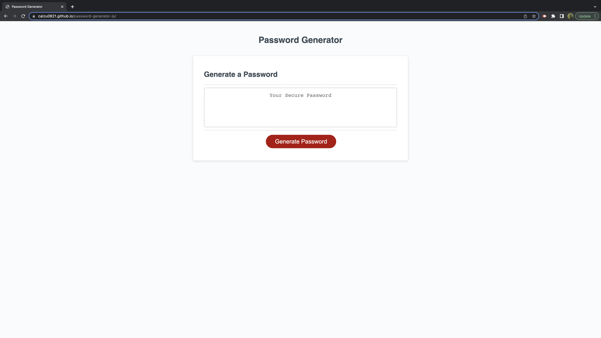
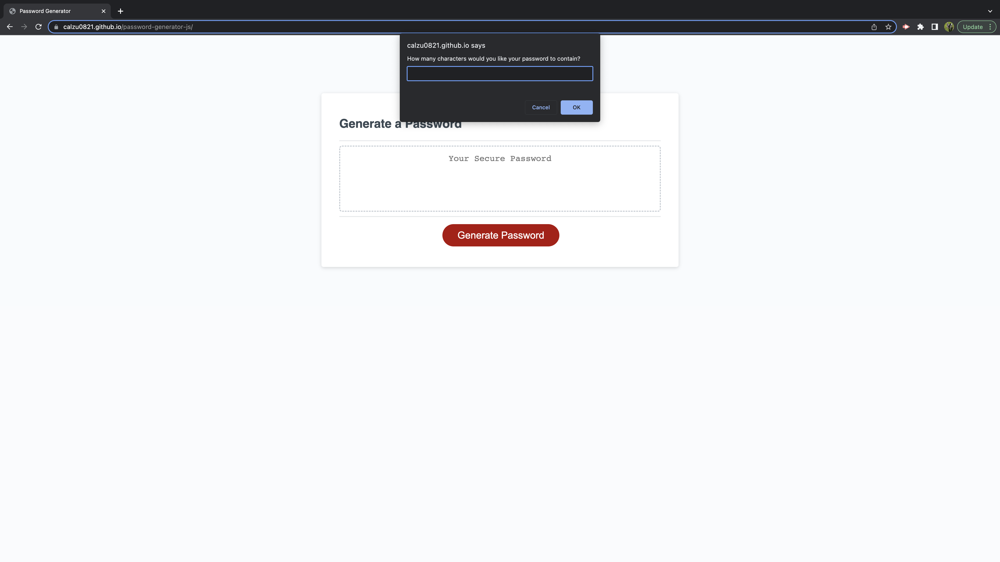

# password-generator-js

## Description

This project is a password generator web application built with HTML, CSS, and JavaScript. The motivation behind building this project was to provide a simple yet secure solution for generating passwords with different combinations of characters, lengths, and criteria that users can customize according to their preferences.

The problem it solves is the common issue of weak passwords that are easy to guess, leaving user accounts vulnerable to hacking attempts. With this application, users can generate strong, random passwords that meet specific criteria, such as uppercase letters, lowercase letters, numbers, and special characters.

Through building this project, I learned about various JavaScript concepts, such as functions, arrays, loops, and conditional statements, and how they can be used to create interactive web applications.

## Installation

Follow these steps to install this project:

1. Clone the repository on your local machine using the following command:

git clone https://github.com/calzu0821/password-generator-js.git

2. Open the index.html file in your web browser to view the webpage.

## Usage

To use the password generator application, follow the steps below:

1. Click the "Generate Password" button.

2. The application will prompt you to choose a password length between 8 and 128 characters.

3. Next, you will be prompted to confirm which character types you want to include in your password. You can choose from lowercase, uppercase, numeric, and/or special characters.

4. Once you've made your selections, the application will generate a password that matches your selected criteria.

5. The generated password will be displayed in the text box on the page.

Password Generator Screenshot

Deployed website:

https://calzu0821.github.io/password-generator-js/
 
Screenshot of password generator:

   

## Credits

I used the following third-party assets in this project:

- https://www.programiz.com/javascript/operators
- https://javascript.info/logical-operators
- https://www.tutorialrepublic.com/javascript-tutorial/javascript-loops.php
- https://www.javascripttutorial.net/javascript-function/
- https://javascript.info/array-methods
- https://javascript.info/object
- https://youtu.be/BrQKPm1Uchc
- https://youtu.be/rLPwCAqyCAE
- https://www.youtube.com/watch?v=_E96W6ivHng
- https://www.youtube.com/watch?v=HXNhEYqFo0o
- https://www.youtube.com/watch?v=AY6X5jZZ_JE
- https://youtu.be/hdI2bqOjy3c
- https://eloquentjavascript.net/

## License

N/A
